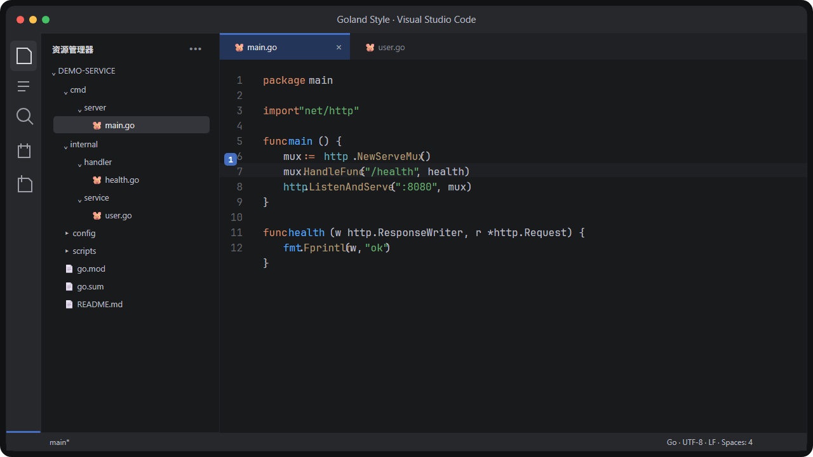
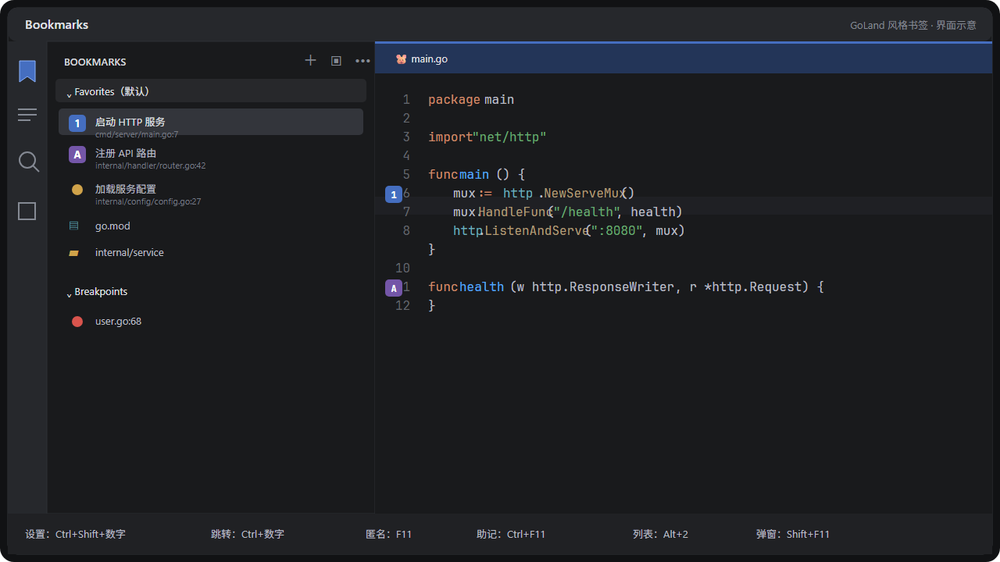
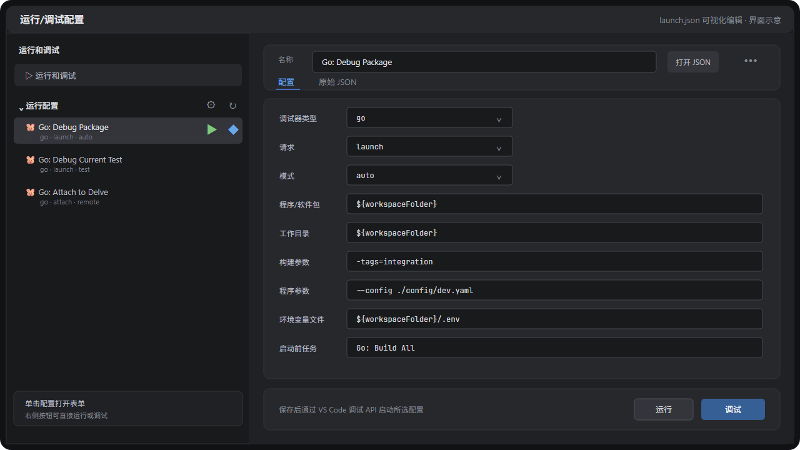

# Goland Style

一个面向 Go 开发的 VS Code 扩展包，在不修改 VS Code 安装文件的前提下，尽量复现 GoLand New UI 的视觉、导航、书签和运行配置体验。

> 非官方项目，与 JetBrains s.r.o. 没有关联。GoLand、IntelliJ IDEA、JetBrains 和 JetBrains Mono 是其各自权利人的商标或资产名称。



> 上图为 VS Code 实际运行截图，代码与路径来自示例项目；实际外观会受 VS Code 版本、系统缩放和已安装扩展影响。

## 功能概览

| 能力 | Goland Style 提供的体验 |
| --- | --- |
| 视觉 | 深色/浅色 JetBrains New UI 风格主题、文件图标、产品图标、紧凑布局和 JetBrains Mono 排版 |
| Go 开发 | 官方 Go 扩展、`gopls`、Delve、语义高亮、Inlay Hints、保存格式化和整理 import |
| 导航 | 默认保留 VS Code 键位；可导入 GoLand Keymap，启用 `Ctrl+B`、`Shift+F6`、`Alt+Left/Right` 等习惯 |
| Bookmarks | 匿名、数字、字母、文件和目录书签，多列表管理、断点汇总、持久化及代码行位置跟随 |
| 运行/调试配置 | 在原生“运行和调试”侧栏集中浏览配置，通过表单编辑 `launch.json`，并直接运行或调试 |
| 测试与任务 | Test Explorer、Benchmark、Coverage，以及构建、测试、竞态检测、Vet 和性能分析任务模板 |
| 可撤销设置 | 自动应用主题和布局前保存用户全局设置，可通过命令恢复并停止后续自动应用 |
| Profile | Core、Full、GoLand Keymap 三套可导入 Profile，按使用场景控制扩展数量 |

完整的 GoLand 能力映射、取舍和平台限制见 [GoLand 功能覆盖矩阵](docs/goland-feature-matrix.md)。

## 快速开始

### 环境要求

- Visual Studio Code 1.95 或更高版本；
- Go 1.21 或更高版本，用于实际 Go 项目；
- Node.js 22 或更高版本，仅在从源码构建扩展时需要。

### Windows 安装

在仓库根目录运行：

```powershell
& '.\Goland Style.bat'
.\scripts\install.ps1 -SkipBuild
```

第一条命令按照锁文件安装依赖、运行完整校验并生成 `dist/Goland-Style.vsix`；第二条命令把刚生成的 VSIX 安装到 VS Code。

如果已经拿到发布包，也可以只把 VSIX 放到 `dist/Goland-Style.vsix`，然后运行：

```powershell
.\scripts\install.ps1 -SkipBuild
```

### Linux / macOS 安装

```bash
npm ci
npm run package
sh ./scripts/install.sh
```

安装完成后，在 VS Code 中执行一次 `Developer: Reload Window`。首次打开 `.go` 文件时，官方 Go 扩展会检查并提示安装兼容版本的 `gopls`、`dlv` 等工具。

### 导入推荐 Profile

打开命令面板，运行 `Profiles: Import Profile`，按需要选择：

| Profile | 文件 | 适用场景 |
| --- | --- | --- |
| Core | `profile/jetbrains-style-go.code-profile` | 推荐默认选择；只包含稳定的 Go 开发和视觉依赖 |
| GoLand Keymap | `profile/jetbrains-style-go-goland-keymap.code-profile` | 在 Core 基础上启用 IntelliJ 键位和 GoLand 书签快捷键 |
| Full | `profile/jetbrains-style-go-full.code-profile` | 额外需要数据库、容器、SSH、Kubernetes、Git 历史或 GitHub PR 时使用 |

独立 Profile 能避免现有用户设置和扩展覆盖主题、字号、图标与按键。Core 和 GoLand Keymap 不应同时作为两套键位使用；切回 VS Code 键位时，请禁用 `IntelliJ IDEA Keybindings` 后重新导入 Core Profile。

## 视觉与编辑体验

扩展默认应用以下体验：

- JetBrains New UI 风格深色和浅色主题；
- JetBrains 风格文件图标与产品图标；
- 左侧 Activity Bar、左侧主侧栏、底部 Panel、隐藏的辅助侧栏，以及用于承载调试控制按钮的顶部 Command Center；
- 多标签、不使用预览标签、修改标签高亮、紧凑目录树；
- JetBrains Mono `13.5px / 21px`，编辑器和终端分别设置合适字号；
- 关闭 Minimap、Breadcrumbs、彩虹括号和非 ASCII 黄色高亮框；
- 开启当前缩进指引、参数提示、Inlay Hints、CodeLens、平滑滚动和 `120` 列标尺；
- Go 文件保存时格式化并显式整理 import；
- `gopls` 语义色、类型诊断和常用 Inlay Hints；默认关闭 Staticcheck 风格警告，减少命名类波浪线。

第一次安装或升级后，扩展会自动应用当前版本的外观和 Go 设置并提示重新加载。应用前的全局设置会被保存，可随时运行：

| 命令 | 作用 |
| --- | --- |
| `Goland Style: 应用 GoLand 风格设置` | 重新应用当前版本的主题、布局、编辑器和 Go 设置 |
| `Goland Style: 恢复应用前的设置` | 恢复第一次应用前的全局值，并停止后续自动应用 |
| `Goland Style: 安装 JetBrains Mono 字体` | 将附带的 JetBrains Mono 2.304 四个基础字形安装到当前系统用户 |
| `Goland Style: 修复 Go 跳转（gopls）` | 检查官方 Go 扩展、工作区信任和语言服务状态，并尝试重启 `gopls` |

字体安装会先显示确认提示。没有安装 JetBrains Mono 时，VS Code 会回退到 Consolas；扩展附带字体遵循 `assets/fonts/OFL.txt` 中的 SIL Open Font License 1.1。

资源管理器默认隐藏 Problems 的黄色警告计数和着色，让文件名优先显示 GoLand 风格的 VCS 状态：修改为蓝色、新增为绿色。Go 编辑器不显示诊断波浪线，但编译、语法和类型诊断数据仍保留在 Problems 列表中；如需恢复行内波浪线，将 Go 语言设置中的 `editor.renderValidationDecorations` 改为 `on`。如需恢复 Staticcheck，可在用户设置的 `gopls` 对象中将 `ui.diagnostic.staticcheck` 改为 `true`。Go import 路径关闭 `namespace` 语义覆盖，使整段路径保持与 GoLand 一致的字符串绿色。

调试会话启动后，继续、暂停、单步、重启和停止按钮显示在窗口顶部的 Command Center，不再悬浮遮挡编辑器。未启动调试时仍可通过左侧“运行和调试”、编辑器运行入口或快捷键启动配置。

## GoLand 风格书签



Bookmarks 工具窗口按工作区保存书签，并提供以下能力：

- 匿名行书签，以及 `0-9` / `A-Z` 助记书签；
- 文件、目录和编辑器标签书签；
- 创建、重命名、删除和设置默认书签列表；
- 拖放书签、跨列表移动，以及列表内向上/向下排序；
- 编辑描述、移除助记符和删除书签；
- 将所有打开的编辑器标签一次加入新列表；
- 在同一工具窗口汇总 VS Code 断点；
- 文本编辑时跟随代码行，工作区内文件重命名时同步 URI；
- 文件被外部修改后，通过当前行和相邻行文本重新定位。

### 最常用工作流

1. 在代码行按 `Ctrl+Shift+数字` 设置或取消数字书签。
2. 在任意位置按 `Ctrl+数字` 跳转到对应书签。
3. 按 `Alt+2` 打开 Bookmarks 工具窗口，浏览所有行、文件、目录书签和断点。
4. 需要匿名书签时按 `F11`；需要数字或字母助记符选择器时按 `Ctrl+F11`。

`Shift+F11` 打开的弹窗支持直接键入字母跳转到对应助记书签。

扩展安装后会默认启用完整书签键位；无需额外导入 GoLand Keymap Profile。Windows/Linux 默认如下：

数字书签使用 `[Digit0]` … `[Digit9]` 物理键扫描码注册，因此在不同键盘布局和输入法下仍显示并使用普通的顶排数字键，不会因 `Shift+数字` 被解析成符号而失效。

| 操作 | 快捷键 |
| --- | --- |
| 切换匿名行书签 | `F11` |
| 添加或修改数字/字母助记书签 | `Ctrl+F11` |
| 直接设置/取消数字书签 | `Ctrl+Shift+0` … `Ctrl+Shift+9` |
| 显示行书签弹窗 | `Shift+F11` |
| 打开 Bookmarks 工具窗口 | `Alt+2` |
| 跳转到数字书签 | `Ctrl+0` … `Ctrl+9` |
| 工具窗口中跳到下一个/上一个书签 | `Ctrl+Alt+Down` / `Ctrl+Alt+Up` |

macOS 对应键位为 `F3`、`Option+F3`、`Command+F3`、`Command+2` 和 `Control+0` … `Control+9`；数字书签仍使用 `Control+Shift+0` … `Control+Shift+9` 设置或取消。

如需恢复 VS Code 原生数字键位，可在设置中关闭 `golandStyle.bookmarks.golandKeybindings`。相关设置如下：

| 设置 | 默认值 | 说明 |
| --- | --- | --- |
| `golandStyle.bookmarks.golandKeybindings` | `true` | 启用 GoLand 默认书签快捷键 |
| `golandStyle.bookmarks.askBeforeReplacingMnemonic` | `true` | 覆盖已被使用的数字或字母前请求确认 |
| `golandStyle.bookmarks.showOnlyLineBookmarksInPopup` | `true` | `Shift+F11` 弹窗默认只显示代码行书签 |

编辑器正文、行号栏、文件树和编辑器标签的右键菜单也提供对应书签操作。

## GoLand 风格运行/调试配置



### 从哪里打开

- 点击 Activity Bar 的“运行和调试”，或按 `Ctrl+Shift+D`，展开“运行配置”；
- 单击配置名称，直接打开并定位到对应的可视化表单；
- 悬停配置项，使用右侧按钮直接运行或调试；
- 使用列表标题栏的齿轮编辑全部配置，或使用刷新按钮重新读取文件；
- 在 Go 编辑器右上角的运行菜单中选择“编辑运行/调试配置”；
- 在命令面板运行 `Goland Style: 编辑运行/调试配置`；
- 打开 `.vscode/launch.json` 后，使用编辑器标题栏的齿轮进入表单。

多目录工作区会先询问目标目录。没有 `.vscode/launch.json` 时，扩展会创建标准的 `0.2.0` 配置骨架。

### 表单能力

左侧配置列表支持新增、复制、删除和排序。右侧表单覆盖 Go 常用场景：

- `launch` / `attach` 请求，以及 `auto`、`debug`、`test`、`exec`、`remote`、`core` 模式；
- 程序或软件包路径、工作目录和调试二进制输出；
- Go 构建参数、程序参数、环境变量和环境变量文件；
- `preLaunchTask`、控制台设置；
- 本地进程附加，以及远程 Delve 主机和端口。

底部“运行”和“调试”会先保存当前表单，再通过 VS Code 调试 API 启动所选配置。

### JSONC 与兼容性

可视化编辑器不会强制替代 VS Code 的文本编辑器：

- 点击“打开 JSON”可以返回普通文本模式；
- “原始 JSON”标签页可编辑完整 JSONC；
- 表单会保留未知字段和第三方调试器配置；
- 修改现有字段使用 JSONC 增量编辑，尽量保留注释；
- 新增、删除或重排整个配置数组时，未知字段仍保留，但数组内部注释可能被格式化器重新排版；
- 保存前会检查必填字段和 `args`、`env`、`compounds` 等基础结构并显示错误。

## 命令入口速查

所有命令都可以在命令面板中按标题搜索；带上下文的书签命令也会出现在编辑器、行号栏、文件树或标签页的右键菜单中。

| 分类 | 用户命令 |
| --- | --- |
| 外观与环境 | 应用 GoLand 风格设置、恢复应用前的设置、安装 JetBrains Mono 字体、修复 Go 跳转（gopls） |
| 运行配置 | 编辑运行/调试配置；列表内提供编辑、刷新、运行和调试操作 |
| 行书签 | 切换匿名书签、切换助记书签、显示行书签、下一个/上一个行书签、当前编辑器中的下一个/上一个行书签 |
| 书签资源 | 添加或删除文件/目录书签、添加文件/目录助记书签、重命名、删除、移除助记符、移动和排序 |
| 书签列表 | 打开 Bookmarks 工具窗口、新建/重命名/删除列表、设为默认列表、将所有打开标签加入新列表 |
| 数字书签 | 切换数字书签 `0-9`、跳转到数字书签 `0-9` |

## 导航与快捷键

默认 Core Profile 保留 VS Code 原生按键：

| 操作 | VS Code 默认 |
| --- | --- |
| 跳转到定义 | `F12` |
| 查找引用 | `Shift+F12` |
| 重命名 | `F2` |
| 快速修复 | `Ctrl+.` |

GoLand Keymap Profile 会额外安装 `IntelliJ IDEA Keybindings`，并把 Windows 的位置历史导航调整为：

| 操作 | GoLand Keymap |
| --- | --- |
| 跳转到声明/定义 | `Ctrl+B` |
| 重命名 | `Shift+F6` |
| 返回上一个编辑位置 | `Alt+Left` |
| 前进到下一个编辑位置 | `Alt+Right` |

该 Profile 会取消 IntelliJ Keybindings 对 `Alt+Left/Right` 的编辑器标签切换绑定，并移除 `Ctrl+Alt+Left/Right` 的导航绑定，避免同一按键执行多个命令。

## Go Snippets

在 Go 文件中输入前缀即可展开：

| 前缀 | 内容 |
| --- | --- |
| `iferr` | 标准 `if err != nil` 错误处理 |
| `iferrw` | 使用 `%w` 包装并返回错误 |
| `gotest` | 带 `t.Parallel()` 的测试函数 |
| `gobench` | 使用 `b.Loop()` 的 Benchmark |
| `gomain` | `package main` 和 `main()` 入口 |

## 项目模板

将 `templates/.vscode` 复制到目标 Go 仓库根目录，可共享：

| 文件 | 内容 |
| --- | --- |
| `settings.json` | Go 格式化、Staticcheck、语义色、Inlay Hints，以及可选 YAML/TOML/Proto 格式化配置 |
| `launch.json` | 调试 Package、当前测试、附加本地进程和远程 Delve |
| `tasks.json` | 构建、生成代码、普通测试、覆盖率、竞态检测、Benchmark、Vet、CPU/内存 profile |
| `extensions.json` | 团队推荐安装 Goland Style 和官方 Go 扩展 |

如果团队不希望提交视觉偏好，可只保留 `launch.json`、`tasks.json` 和 Go 相关的 `settings.json` 字段。

## 扩展依赖与 Full Profile

VSIX 只声明四个核心依赖：

- `golang.go`：官方 Go 语言支持；
- `MS-CEINTL.vscode-language-pack-zh-hans`：微软官方简体中文界面；
- `fogio.jetbrains-file-icon-theme`：JetBrains New UI 文件图标；
- `fogio.jetbrains-product-icon-theme`：JetBrains New UI 产品图标。

EditorConfig、YAML/TOML、Buf/Protobuf、REST Client、TODO、Makefile 等工具按项目需要单独安装，避免无关扩展、外部 CLI 下载和后台进程影响基础 Go 开发。

Full Profile 额外提供 GitLens、GitHub Pull Requests、Container Tools、Dev Containers、Remote SSH、Kubernetes、SQLTools 及常用数据库驱动和 XML。这些扩展可能需要账号、外部程序或连接权限，因此不会随 VSIX 自动安装。Code Spell Checker 不再包含在 Profile 中，避免对 Go 包名、标识符和 import 路径显示与 GoLand 不一致的拼写波浪线。

## 常见问题

### 跳转定义、重构或 CodeLens 不工作

如果窗口顶部显示 `Restricted Mode`，仅在确认源码可信时信任工作区。受限模式会停用 `gopls`，导致 Ctrl+鼠标、`F12`、`Ctrl+B`、重构和 CodeLens 不可用。

信任后运行 `Goland Style: 修复 Go 跳转（gopls）`。如果仍提示缺少工具，再运行 `Go: Install/Update Tools` 安装 `gopls`。

### 中文界面没有自动启用

语言包会随扩展安装，但普通扩展不能强制修改全局显示语言。运行 `Configure Display Language`，选择 `中文（简体）/ zh-cn`，然后重启 VS Code。

### 字体看起来不像 GoLand

GoLand 自带运行时中的 JetBrains Mono 不会自动注册为 Windows 系统字体。运行 `Goland Style: 安装 JetBrains Mono 字体` 后重新加载窗口；显示器 DPI 和系统缩放仍会影响实际物理大小。

### `Alt+2` 或其他书签快捷键没有反应

确认 `golandStyle.bookmarks.golandKeybindings` 没有被手动关闭。如果系统、输入法或其他扩展占用了按键，可在 `Preferences: Open Keyboard Shortcuts` 中搜索对应命令检查冲突。

## 视觉基准

深色主题的主要参考值：

| 区域 | 配置 |
| --- | --- |
| 编辑器和主侧栏背景 | `#191A1C` |
| 顶部栏和 Activity Bar | `#26282C` |
| 文件树选中项 | `#33353B` |
| 活动页签 | `#233558`，顶部强调线 `#456EC0` |
| 当前行 | `#1F2024` |
| 普通代码 | `#BCBEC4` |
| 关键字 | `#CF8E6D` |
| 字符串 | `#6AAB73` |
| 数字 | `#2AACB8` |
| 函数声明 | `#56A8F5` |
| 函数调用 | `#B09D79` |
| 类型 | `#6FAFBD` |
| Inlay Hint | 前景 `#858A94`，背景 `#2A2C30` |

排版基线：

```json
{
  "window.zoomLevel": 0,
  "editor.fontFamily": "'JetBrains Mono', JetBrainsMono, Consolas, 'Courier New', monospace",
  "editor.fontSize": 13.5,
  "editor.lineHeight": 21,
  "editor.fontWeight": "400",
  "editor.letterSpacing": 0,
  "editor.fontLigatures": true
}
```

## VS Code 平台限制

普通 VS Code 扩展无法完整复制以下 GoLand 专有体验：

- Project、编辑器和工具窗口的大圆角容器；
- 单独控制文件树字体、字号和精确行高；
- 把内置 Explorer 标题改为 Project，或隐藏单目录工作区根节点；
- JetBrains 专有索引、检查、重构界面、数据库对象编辑器和统一 Profiler。

本项目不会修改 VS Code 安装文件或注入 Custom CSS，因为这会破坏完整性校验，并且容易在 VS Code 更新后失效。

## 开发与校验

```bash
npm ci
npm test
npm run package
```

主要生成物：

```text
dist/Goland-Style.vsix
profile/jetbrains-style-go.code-profile
profile/jetbrains-style-go-goland-keymap.code-profile
profile/jetbrains-style-go-full.code-profile
```

`npm test` 会重新生成三套 Profile，并检查核心/完整扩展依赖、主题、参考色、字体参数、Snippets、Bookmarks、运行配置 JSONC 保真、扩展运行时设置和项目模板。

Marketplace 发布流程见 [发布说明](docs/publishing.md)。

## 许可证

项目代码采用 MIT License，完整条款见 [LICENSE](LICENSE)。本项目不包含 GoLand 源码、专有主题文件或专有图标资源；第三方扩展分别遵循其自身许可证和隐私政策。
